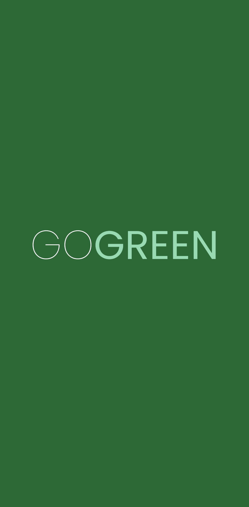
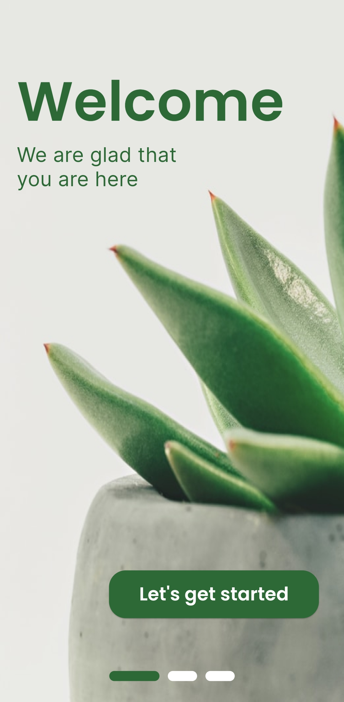
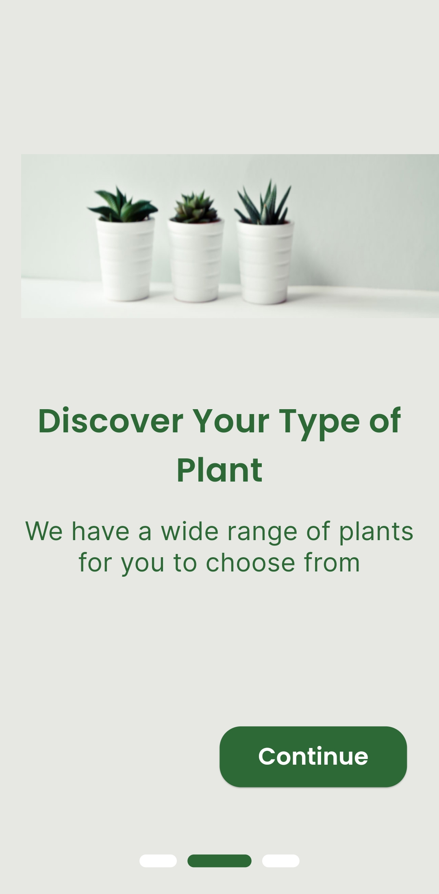
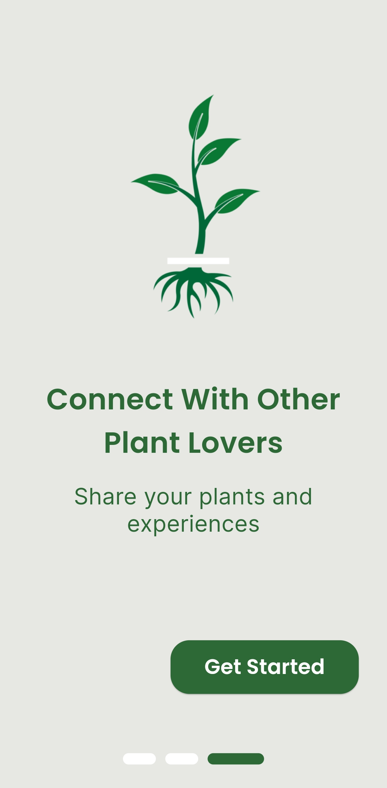

# GOGREEN

Splash screen and onboarding screen for the GOGREEN app. The landing page was designed by Ozioma Okechukwu. You can view the design on [Figma](https://www.figma.com/community/file/1124802490488661534).

## Used Packages:
- `flutter_bloc`: For managing the state of the pages.
- `google_fonts`: For the custom fonts used.
- `dots_indicator`: For the indicator in the onboarding screens.

## App Screenshots and Preview:

  
  
  
  
  

